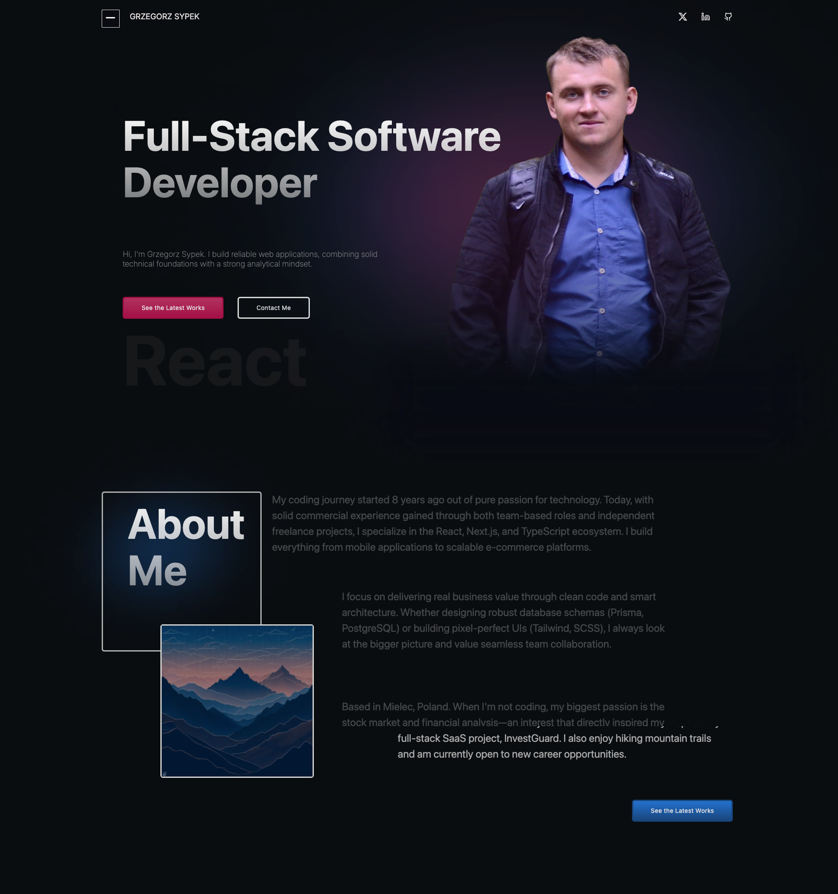

# Personal Developer Portfolio


## 📌 Overview
A modern, interactive Single Page Application (SPA) built to showcase my professional journey, technical skills, and recent projects as a Full-Stack Developer. 

The application is bootstrapped with **Vite** for lightning-fast performance and heavily utilizes **Framer Motion** to deliver a smooth, engaging user experience through advanced scroll animations and micro-interactions.

[**🔗 Visit the live portfolio**](https://gregsypek-p3.vercel.app/)

---

## 📸 Preview

<div align="center">
  
  <p><i>Responsive Desktop & Mobile Layout</i></p>
</div>

---

## 🚀 Key Features

* **Interactive UI/UX:** Advanced scroll-triggered animations and fluid component transitions powered by **Framer Motion**.
* **Responsive Architecture:** A mobile-first, fully responsive design crafted with **Tailwind CSS**, ensuring seamless scaling across all devices.
* **Component-Driven:** Clean, modular React architecture with reusable UI components and customized utility classes.
* **Serverless Contact Form:** Direct messaging system integrated with **EmailJS**, allowing recruiters and clients to reach out without requiring a custom backend.
* **Optimized Build:** Configured with **Vite** for rapid development (HMR) and highly optimized, minified production builds.

## 🛠️ Tech Stack

* **Core:** React, TypeScript, Vite
* **Styling:** Tailwind CSS
* **Animations:** Framer Motion
* **Integrations:** EmailJS (Serverless emails)
* **Deployment:** Vercel

## ⚙️ Local Setup

To run this project locally, follow these steps:

1. Clone the repository:
   ```bash
   git clone https://github.com/gregsypek/portfolio_v3.git
   ```

2. Navigate to the project directory:
   ```bash
   cd portfolio_v3
   ```

3. Install dependencies:
   ```bash
   npm install
   ```

4. Create a `.env` file in the root directory and add your EmailJS keys:
   ```env
   VITE_PUBLIC_KEY=your_public_key
   VITE_APP_SERVICE_ID=your_service_id
   VITE_APP_TEMPLATE_ID=your_template_id
   ```

5. Start the development server:
   ```bash
   npm run dev
   ```